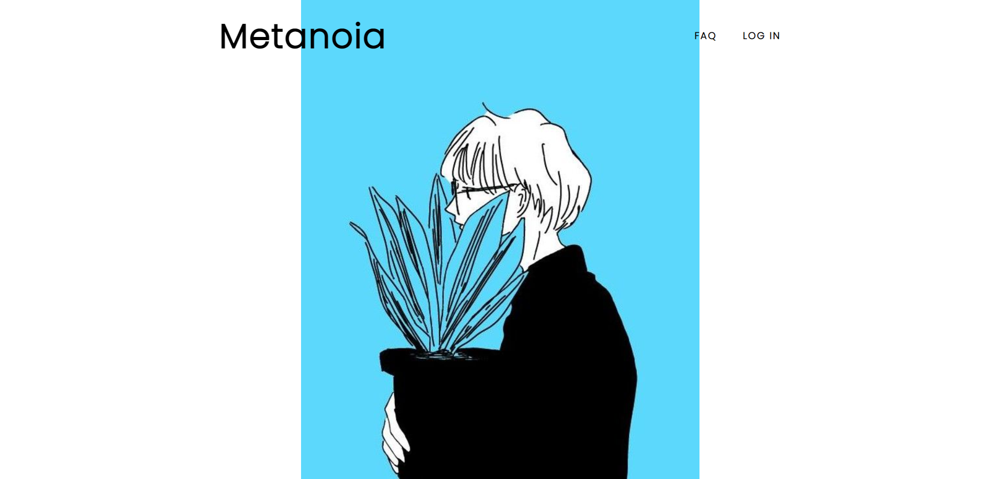
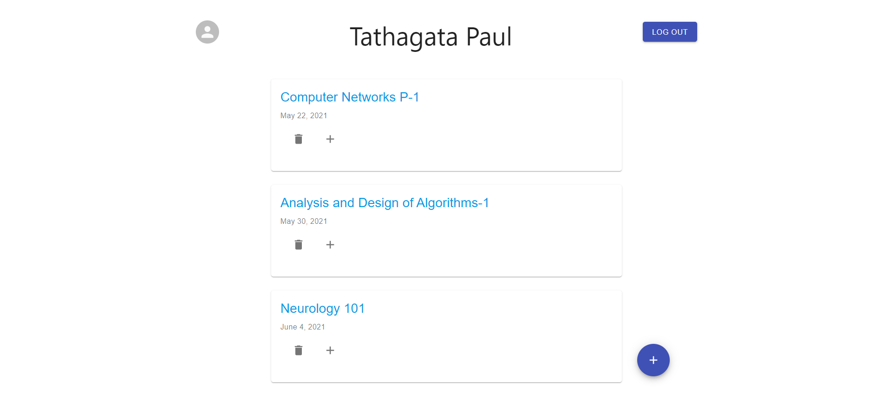
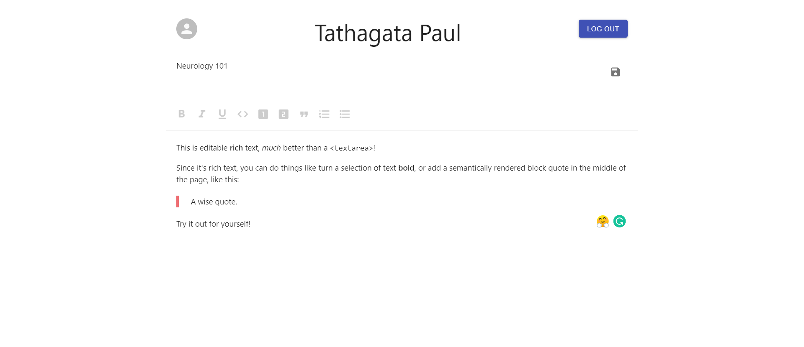

# slate collaboration by relaying operations

A Realtime Collaborative Editor using slate

> forked from https://github.com/4molybdenum2/Metanoia

# usage

```shell
# in ./server/.env, set mongoURI=mongodb://localhost:27017/name

# start server
cd server
npm i
npm start

# start web frontend
cd web
npm i
npm start

```

- open http://localhost:3000

- test collaboration in 2 browsers
- choose user11 in one browser, user12 in another
- click fetchNotes to fetch existing notes, or add notes button to add new notes
- click the same note in two browsers to start collaborative editing

> 🚨 limitations

- the server just relay operations to all clients, without operation transformation.
  - most operations are expected to be applied on client side by server-received-order without conflicts, following last-write-win at field level
  - few operations may cause unexpected conflicts
# Idea

One of the issues we face during our virtual hours is a collaboration with our fellow teammates in taking notes, coding, or in general collaborating over a specific document. My project seeks to solve this issue by creating an app in which we can focus on doing our own tasks while the tasks we do are reflected in real-time to our team members. This has a wide variety of applications most useful for students and office workers in their day-to-day tasks.

Metanoia will help solve this issue!

# Showcase

### Homepage:

<p align='center'>

    

</p>

### Dashboard:

<p align='center'>

    

</p>

### Note:

<p align='center'>

    

</p>

# Features
- Users can perform CRUD operations on a Note that was created by them
- Users can add collaborators to the Note created by them for Live-Editing purposes.
- Changes made to a Note will be visible in real-time to all its current editors
- Users are authenticated with the help of Google+ API.
- Users can't access other users' notes if they are not an owner or collaborator.
- Custom formatting can be added to the Note including bold, italic, underline, code-block, creating headers, quotes, and lists both ordered and unordered!
# Tech-Stack:

 

- **TypeScript** and **Javascript** as the programming languages
- **ReactJS** on the frontend and **ExpressJS + NodeJS** on the backend
- **SlateJS** for making the text-editor
- **Socket. IO** for emitting and receiving changes to the Editor for Live-Editing.
- **MongoDB** as a database
# Scope

A Real-time Collaborative Editor has infinitely many use cases. Users can use such an app for taking notes, managing their schedules, keeping track of their important tasks, and much more. Students can utilize such an app for their creative as well as educational needs. 

A group of students can collaborate on a piece of code for their competitive programming challenges or maybe for taking notes consistently in their classes. Employees in an office can keep track of their daily tasks. Writers and creators can utilize such an app for their writing. The use cases of Metanoia are endless...

# Challenges Faced:

**How to create a custom text editor?**
A lot of options were researched for the building of a text editor which supports custom formatting. Some of the options were Draft, Quill, etc. Also, thoughts were there to make a mobile app using FlutterQuill instead of a web application.

**How to update changes across multiple users at the same time?**
This was solved with the help of WebSockets using Socket. IO which helps in emitting the operations that were performed in the text editor that can be received by clients that belong to a particular room represented by the ID of the document.

**How to reduce the number of queries to the database?**
At first, all of the operations performed to the text editor were emitted as events (such as clicking anywhere on the text editor). This was prevented by filtering out some of the operations that were performed by Slate using a filter() method. Later, non of the operations performed were directly pushed to the database rather a save button was put to save the document at any point of time. This led to the reduction of a large no. of queries that were made whenever a user made a single entry to the text editor.

**How to handle user authentication?**

Google+ API along with PassportJS were used to handle the authentication in the backend. All the backend routes are authenticated. Context API has been used in the frontend for authentication. User is stored in a global context.

**How to add collaborators to a Note (and manage access to it) ?**

This was done by adding a *"collabs"* array field in the database that contained the emails of all the collaborators including the user. A check was performed with the client and this array field to check whether he/she is a collaborator.

# Later Goals:
- Add a chatroom for the collaborators to chat in.
- ~~Add support for invitations as collaborators.~~
- ~~Add support for adding hyperlink and images to the note~~
- Add support for emitting their current cursor location along with their username/email
- Add support for auto-saving the Note after a given time interval
- Offline saving (using Automerge's CRDT data structures)
